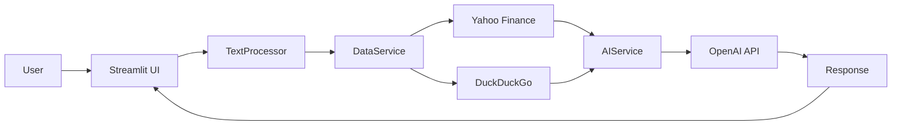
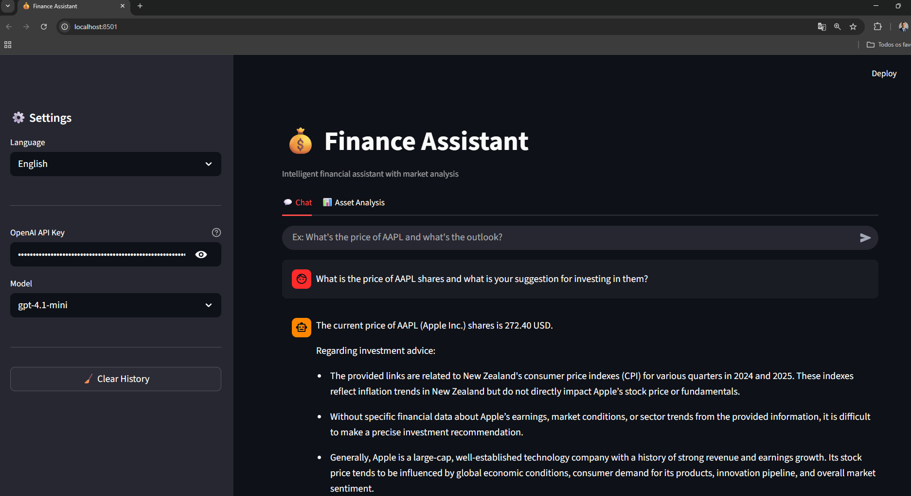
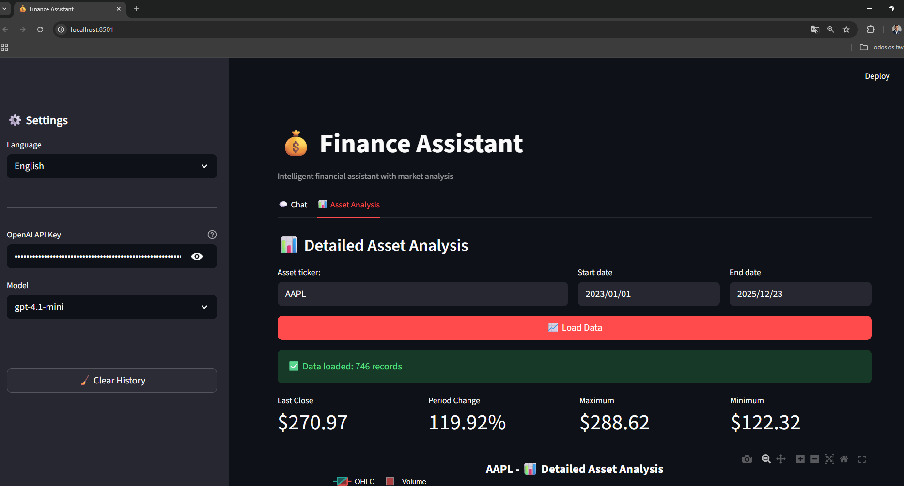

# 🤖💰 AGNO Financial Agentic AI

<div align="center">


[](https://www.python.org/)
[](https://streamlit.io/)
[](https://openai.com/)
[](LICENSE)

**An Intelligent Financial Assistant with Agentic AI for Real-Time Market Analysis**

[Features](#-features) • [Installation](#-installation) • [Usage](#-usage) • [Architecture](#-architecture) • [Technologies](#-technologies)

</div>

---

## 📋 About the Project

**AGNO Financial Agentic AI** is an intelligent financial assistant that leverages advanced artificial intelligence (OpenAI GPT) to deliver real-time market analysis, asset insights, and contextual investment-related answers.

The system combines data from multiple sources (real-time prices via Yahoo Finance, news via DuckDuckGo) with AI reasoning capabilities to provide accurate and actionable analysis.

### 🎯 Objective

To democratize access to high-quality financial analysis through an intuitive conversational interface, enabling investors of all levels to make more informed decisions.

---

## ✨ Features

### 💬 Intelligent Chat

* **Natural Conversation**: Ask about stocks, cryptocurrencies, and financial assets using natural language
* **Contextual Analysis**: AI considers current prices, recent news, and market history
* **Multi-Ticker Support**: Analyze multiple assets simultaneously
* **Conversation History**: Maintains context across interactions

### 📊 Detailed Asset Analysis

* **Interactive Charts**: Candlestick (OHLC) and volume visualization
* **Real-Time Metrics**: Current price, period variation, highs and lows
* **Historical Data**: Customizable time-range analysis
* **Targeted Questions**: Ask specific questions about a selected asset

### 🌍 Multilingual Support

* **Portuguese (PT-BR)**: Interface and responses in Portuguese
* **English (EN)**: Interface and responses in English
* **Instant Switching**: Change language at any time

### 🔍 News Search

* **DuckDuckGo Integration**: Automatic search for relevant news
* **Up-to-Date Context**: AI incorporates recent news into analysis
* **Direct Links**: Access original news sources

---

## 🚀 Installation

### Prerequisites

* Python 3.8 or higher
* pip (Python package manager)
* OpenAI API key ([get one here](https://platform.openai.com/api-keys))

### Step-by-Step

1. **Clone the repository**

```bash
git clone https://github.com/your-username/agno-financial-agentic-ai.git
cd agno-financial-agentic-ai
```

2. **Create a virtual environment (recommended)**

```bash
python -m venv venv
source venv/bin/activate  # Linux/Mac
# or
venv\Scripts\activate  # Windows
```

3. **Install dependencies**

```bash
pip install -r requirements.txt
```

4. **Run the application**

```bash
streamlit run app.py
```

5. **Open in your browser**

```
http://localhost:8501
```

---

## 📦 Dependencies

Create a `requirements.txt` file with:

```txt
streamlit>=1.28.0
yfinance>=0.2.31
pandas>=2.0.0
plotly>=5.17.0
openai>=1.3.0
duckduckgo-search>=3.9.0
```

---

## 💻 Usage

### 1️⃣ Initial Setup

In the sidebar:

* Select the **language** (Portuguese or English)
* Enter your **OpenAI API Key**
* Choose the **model** (recommended: gpt-4-turbo)

### 2️⃣ Chat with the Assistant

**Example questions:**

```
🇺🇸 English:
- "How is AAPL stock performing today?"
- "Compare NVDA and AMD for investment"
- "What is the Bitcoin outlook?"
- "Is TSLA a good buy right now?"

🇧🇷 Portuguese:
- "Como está o preço da AAPL hoje?"
- "Compare NVDA e AMD para investimento"
- "Qual a perspectiva do Bitcoin?"
- "PETR4 vale a pena comprar agora?"
```

### 3️⃣ Detailed Asset Analysis

1. Go to the **"Asset Analysis"** tab
2. Enter the **ticker** (e.g., AAPL, MSFT, PETR4.SA, BTC-USD)
3. Select the **date range**
4. Click **"Load Data"**
5. View charts and metrics
6. Ask **specific questions** about the asset

---

##  Architecture

### Project Structure

```
agno-financial-agentic-ai/
│
├── app.py                 # Main application
├── plots.py               # Visualization module
├── requirements.txt       # Dependencies
├── README.md              # Documentation
│
└── .streamlit/
    └── config.toml        # Streamlit configuration
```

### Core Components

#### 🗄️ **DataService**

* Fetches financial data via Yahoo Finance
* Retrieves historical and real-time prices
* Integrates DuckDuckGo for news

#### 🧠 **AIService**

* Handles OpenAI API communication
* Prompt and context management
* Multilingual responses

#### 📝 **TextProcessor**

* Automatic ticker extraction from text
* Stop-word filtering
* Financial symbol validation

#### 📊 **StockChart**

* Interactive charts using Plotly
* Candlestick (OHLC) visualization
* Volume analysis

### Data Flow



---

## 🛠️ Technologies

### Core

* **[Streamlit](https://streamlit.io/)** – Web interface framework
* **[OpenAI API](https://openai.com/)** – Language models (GPT-4, GPT-3.5)
* **[Python 3.8+](https://www.python.org/)** – Base language

### Financial Data

* **[yfinance](https://github.com/ranaroussi/yfinance)** – Market data via Yahoo Finance
* **[pandas](https://pandas.pydata.org/)** – Data manipulation
* **[DuckDuckGo Search](https://github.com/deedy5/duckduckgo_search)** – News search

### Visualization

* **[Plotly](https://plotly.com/)** – Interactive charts
* **Candlestick Charts** – Professional OHLC visualization

---

## 🎨 Screenshots

### Chat Interface



### Asset Analysis



---

## 🔧 Advanced Configuration

### Environment Variables (Optional)

Create a `.env` file:

```env
OPENAI_API_KEY=your-key-here
DEFAULT_LANGUAGE=en
DEFAULT_MODEL=gpt-4-turbo
```

### Ticker Customization

Edit `TextProcessor.STOP_WORDS` to add or remove filtered words:

```python
STOP_WORDS = {
    "AND", "OR", "THE", "NEWS", "STOCK",
    # Add your own words here
}
```

---

## 📈 Roadmap

* [ ] More language support (Spanish, French)
* [ ] Advanced technical analysis (RSI, MACD, Bollinger Bands)
* [ ] Custom price alerts
* [ ] PDF report export
* [ ] More data sources
* [ ] Portfolio tracking
* [ ] Strategy backtesting
* [ ] Dark/Light theme support

---

## 🤝 Contributing

Contributions are welcome! To contribute:

1. Fork the project
2. Create a branch (`git checkout -b feature/NewFeature`)
3. Commit your changes (`git commit -m 'Add new feature'`)
4. Push to the branch (`git push origin feature/NewFeature`)
5. Open a Pull Request

---

## 📄 License

This project is licensed under the MIT License. See the [LICENSE](LICENSE) file for details.

---

## ⚠️ Disclaimer

**This project is for educational and informational purposes only.**

* It does not constitute financial advice
* It does not recommend buying or selling assets
* Users are responsible for their own investment decisions
* Always consult a qualified professional before investing

---

## 🙏 Acknowledgements

* [OpenAI](https://openai.com/) for the AI API
* [Streamlit](https://streamlit.io/) for the amazing framework
* [Yahoo Finance](https://finance.yahoo.com/) for market data
* The open-source community for the libraries used

---

<div align="center">

**⭐ If you found this project useful, consider giving it a star!**

Made with ❤️ and 🤖 by **Jonathan Cristovão**

</div>

---